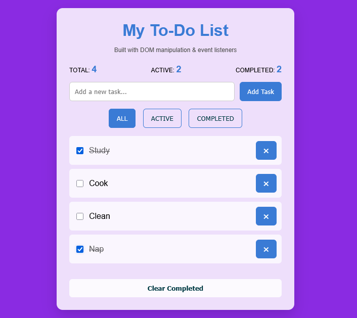

# Week 5: DOM Manipulation

## Author
- **Name:** Maureen Muchoki  
- **GitHub:** [@Maureenmuchoki](https://github.com/maureenmuchoki-hub)  
- **Date:** March 23, 2026  

## Project Description
This project is a dynamic To-Do List application built using HTML, CSS, and JavaScript. It allows users to add, mark as completed, filter, and delete tasks, helping to manage daily activities efficiently while practicing DOM manipulation and event handling.

## Technologies Used
- HTML5  
- CSS3  
- JavaScript
- DOM API 

## Features
- Add new tasks dynamically
- Mark tasks as completed or active
- Filter tasks (All, Active, Completed)
- Delete individual tasks
- Clear all completed tasks
- Real-time task counters (Total, Active, Completed)
- Keyboard support (Enter key to add tasks)

## How to Run
1. Clone this repository:
   ```bash
   git clone https://github.com/maureenmuchoki-hub/iyf-s10-week-05-Maureenmuchoki.git

## Lessons Learned
- Working with the DOM to dynamically create, update, and remove elements
- Handling user events such as clicks and keyboard inputs
- Implementing task filtering logic
- Managing application state (completed, active tasks) in real-time

## Challenges Faced
- Ensuring the filtering worked correctly while tasks were added or deleted
- Updating task counters dynamically after every action
- Managing checkboxes to reflect task completion properly
- Solved these by using event listeners, class toggling, and a dedicated displayTasks function

## Screenshots



## Live Demo

[My To-Do List App](https://maureenmuchoki-hub.github.io/iyf-s10-week-05-Maureenmuchoki/index.html)
